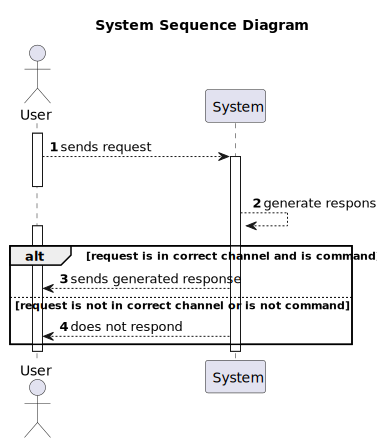

# Chat GPT Discord Bot

## What is this?

This is a Discord bot that uses Chat GPT's technology to generate responses to messages in a Discord server(using AI).

## How do I use it?

1. Clone this repository
2. Create a Discord bot and invite it to your server
3. Grab the bot's token and replace it in your own '.env' file (template provided)
4. Grab the Chat GPT API key and replace it in your own '.env' file (template provided)
5. Run 'pip install -r "path"/requirements.txt' to install dependencies
6. Run 'python3 "path"/run.py' to start the bot
7. Create a channel with the following names: {'gpt-questions', 'chatgpt', 'gpt-bot'}
8. Type '/ai message' or '/bot message' or '/chatgpt message' in the current channel and wait for the response
9. Enjoy!

## Visual representation of the system

System sequence diagram:

: 

Sequence diagram of the bot:

: 

Bot setup:

: 

## Dependencies

- Python 3.10.0
- discord.py 2.1.0
- python-dotenv 0.21.0
- requests 2.25.1